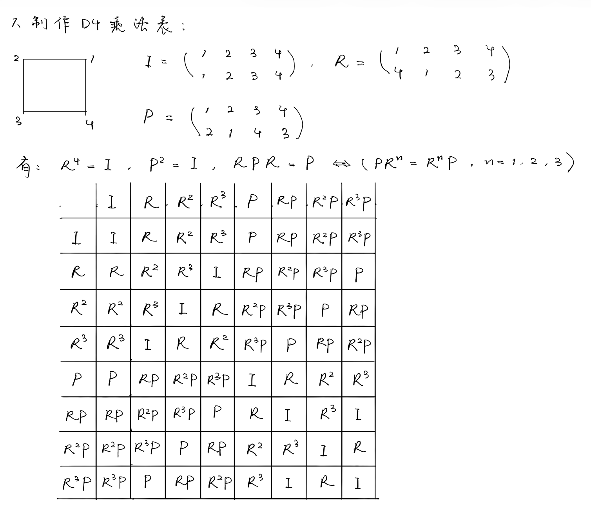

# 群的基本概念和群的线性表示理论

## 线性代数回顾

### 线性空间

¶设对于*Hamilton*算符$\hat{H}$, 作用于$m$个线性无关的态${\bm{\psi}_{\mu}},\,\mu=1,\dots,m$, 得到本征值能量$E$,

$$
\hat{H}{\bm{\psi}_{\mu}}=E{\bm{\psi}_{\mu}},
$$

那么${\bm{\phi}}={\bm{\psi}_{\mu}}a^{\mu}$的线性组合仍是本征态.

$$
{\bm{\psi}_{\mu}}a^{\mu}\in\operatorname{span}\{{\bm{\psi}_{\mu}}\}\equiv\mathcal{L},\,\operatorname{dim}\mathcal{L}=m.
$$

设$\mathcal{L}^{(1)},\mathcal{L}^{(2)}\subset\mathcal{L}$, 当

$$
\mathcal{L}=\mathcal{L}^{(1)}+\mathcal{L}^{(2)},
$$

且三个等价条件(1)$\mathcal{L}^{(1)}\cap\mathcal{L}^{(2)}=\bm{0}$,
(2)$\operatorname{dim}\mathcal{L}=\operatorname{dim}\mathcal{L}^{(1)}+\operatorname{dim}\mathcal{L}^{(2)}$, (3)对于${\bm{\phi}}\in\mathcal{L}$, $!\exist{\bm{\phi}^{(1)}}\in\mathcal{L}^{(1)},\,{\bm{\phi}^{(2)}}\in\mathcal{L}^{(2)}\ \text{s.t.}\ {\bm{\phi}}={\bm{\phi}^{(1)}}+{\bm{\phi}^{(2)}}$满足之一, 则称$\mathcal{L}$为$\mathcal{L}^{(1)}$和$\mathcal{L}^{(2)}$的直和, 记$\mathcal{L}=\mathcal{L}^{(1)}\oplus\mathcal{L}^{(2)}$.

### 线性算符

¶线性算符$\hat{T}$描述$\mathcal{L}$上的线性变换, 满足

$$
\hat{T}(c^{(1)}{\bm{\phi}^{(1)}}+c^{(2)}{\bm{\phi}^{(2)}})=c^{(1)}\hat{T}({\bm{\phi}^{(1)}})+c^{(2)}\hat{T}({\bm{\phi}^{(2)}}),
$$

因为这种性质, $\hat{T}$在固定基后可被矩阵表示$[\hat{T}]_{\bm{\psi}}=T^{\mu}_{\nu}$. 那么$\hat{T}(\bm{\psi}_{\mu}a^{\mu})$在$\bm{\psi}_{\nu}$上的分量

$$
[\hat{T}(\bm{\psi}_{\mu}a^{\mu})]^{\nu}=[\hat{T}(\bm{\psi}_{\mu})a^{\mu}]^{\nu}=[\bm{\psi}_{\nu}T^{\nu}_{\mu}a^{\mu}]^{\nu}=T^{\nu}_{\mu}a^{\mu}.
$$

¶如果算符$\hat{R}$与$\hat{H}$对易, 则

$$
\hat{H}(\hat{R}\bm{\psi}_{\mu})=E\hat{R}\bm{\psi}_{\mu},
$$

即$\hat{R}(\bm{\psi}_{\mu})\in\mathcal{L}$.

### 相似变换(Similarity Transformation)

¶设两个基之间有如下变换关系

$$
e'_{\mu}=\bm{e}_{\nu}S^{\nu}_{\mu},
$$

则同一线性算符$\hat{R}$在不同基下的矩阵表示存在关系

$$
\left\{\begin{aligned}
&\hat{R}(e'_{\mu})=e'_{\nu}R^{\nu}_{\mu}=\bm{e}_{\sigma}S^{\sigma}_{\nu}(R')^{\nu}_{\mu},\\
&\hat{R}(e'_{\mu})=\hat{R}(\bm{e}_{\nu}S^{\nu}_{\mu})=\bm{e}_{\sigma}R^{\sigma}_{\nu}S^{\nu}_{\mu},
\end{aligned}\right.
\Longrightarrow \bm{R}'=\bm{S}^{-1}\bm{R}\bm{S}.
$$

相似变换不改变$\hat{R}$的作用效果

$$
b'^{\mu}=(R')^{\mu}_{\nu}a'^{\nu}=(S^{-1}RS)^{\mu}_{\nu}(S^{-1}a)^{\nu}=(S^{-1})^{\mu}_{\nu}b^{\nu}.
$$

¶称拥有如下性质的空间$\mathcal{K}$为算子$\hat{R}$的不变空间(invariant space)

$$
\hat{R}(\bm{a})\in\mathcal{K},\ \forall \bm{a}\in\mathcal{K}.
$$

设$\mathcal{L}^{(1)}$是$\hat{R}$的不变空间, 而$\mathcal{L}^{(2)}$是其互补子空间, 取
$\bm{e}_{\mu}\in\mathcal{L}^{(1)},\,\mu=1,\dots,n;\ \bm{e}_{\nu}\in\mathcal{L}^{(2)},\,\nu=n+1,\dots,m,$则$\hat{R}$在基下表示为上三角矩阵

$$
\bm{R}=\left(
\begin{matrix}
\bm{R}^{(1)}&\bm{M}\\\bf{0}&\bm{R}^{(2)}.
\end{matrix}
\right)
$$

### 对角化

¶设$\hat{R}$有$m$个本征矢量$\bm{v}^{(i)}$（非简并）构成了$m$个一维的不变子空间, 则在特定基下

$$
\bm{V}\bm{\Lambda}\equiv
(\bm{v}^{(1)}\dots\bm{v}^{(m)})
\left(\begin{matrix}
\lambda^{(1)}\\&\ddots\\&&\lambda^{(m)}
\end{matrix}\right)=\bm{R}(\bm{v}^{(1)}\dots\bm{v}^{(m)}),
$$

则

$$
\bm{R}=\bm{V}\bm{\Lambda}\bm{V}^{-1}.
$$

### 内积

¶内积$\braket{\cdot|\cdot}$满足以下性质（注意物理中更常采用右线性）

$$
\begin{aligned}
&\braket{\bm{\psi}|c^{(1)}\bm{\phi}^{(1)}+c^{(2)}\bm{\phi}^{(2)}}=c^{(1)}\braket{\bm{\psi}|\bm{\phi}^{(1)}}+c^{(2)}\braket{\bm{\psi}|\bm{\phi}^{(2)}},\\
&\braket{\bm{\phi}|\bm{\psi}}=\braket{\bm{\psi}|\bm{\phi}}^{*},\\
&\braket{\bm{\phi}|\bm{\phi}}=|\bm{\phi}|^2\geq0.
\end{aligned}
$$

规定度规

$$
g_{\mu\nu}=\braket{\bm{e}_{\mu}|\bm{e}_{\nu}},
$$

则内积用度规表示

$$
\braket{\bm{\phi}|\bm{\psi}}=(\phi^{\mu})^{*}g_{\mu\nu}\psi^{\nu}.
$$

¶共轭算符$\hat{R}^{\dag}$定义为满足

$$
\braket{\hat{R}\bm{\phi}|\bm{\psi}}=\braket{\bm{\phi}|\hat{R}^{\dag}\bm{\psi}},
$$

在内积的矩阵乘法定义下

$$
\braket{\bm{R}\bm{\phi}|\bm{\psi}}=\bm{\phi}^{\dag}\bm{R}^{\dag}\bm{\psi}=\braket{\bm{\phi}|\bm{R}^{\dag}\bm{\psi}},
$$

此时共轭算符的矩阵表示正是算符矩阵表示的共轭转置.

### 张量积

¶定义张量积

$$
\bm{A}_{m\times n}\otimes\bm{B}_{r\times s}=
\left(\begin{matrix}
a_{11}\bm{B}_{r\times s}&\cdots&a_{1n}\bm{B}_{r\times s}\\
\vdots&&\vdots\\
a_{m1}\bm{B}_{r\times s}&\cdots&a_{mn}\bm{B}_{r\times s}
\end{matrix}\right)_{mr\times ns},
$$

可以证明

$$
\begin{aligned}
&\operatorname{tr}(\bm{A}\otimes\bm{B})=\operatorname{tr}(\bm{A})\operatorname{tr}(\bm{B}),\\
&[(\bm{A}_{1})_{m\times n}\otimes(\bm{B}_{1})_{r\times s}][(\bm{A}_{2})_{n\times m}\otimes(\bm{B}_{2})_{s\times r}]=(\bm{A}_{1}\bm{A}_{2})\otimes(\bm{B}_{1}\bm{B}_{2}),\\
&(\bm{A}\otimes\bm{B})^{-1}=\bm{A}^{-1}\otimes\bm{B}^{-1},\\
&\det(\bm{A}_{n}\bm{B}_{m})=(\det\bm{A})^{n}(\det\bm{B})^{m}.
\end{aligned}
$$

## 群的基本概念

### 群的定义和乘法表

>==群== 称保持系统不变的变换为系统的对称变换, 研究一个系统的对称变换集合$\mathcal{G}$总结出群的概念：
>一个满足以下性质的系统$(\mathcal{G},\cdot)$, 一个配有复合乘法$(\cdot)$的非空集合$\mathcal{G}$
>
>1. 封闭性
>$$rs\in \mathcal{G},\quad\forall r,s\in \mathcal{\mathcal{G}}.$$
>2. 结合律
>$$r(st)=(rs)t,\quad\forall r,s,t\in \mathcal{G}.$$
>3. 存在左乘法元
>$$\exist e'\in \mathcal{G}\ \text{s.t.}\ \forall r\in \mathcal{G},\ e'r=r.$$
>4. 每个元素都存在左逆
>$$\forall r\in \mathcal{G},\ \exist r'\in \mathcal{G}\ \text{s.t.}\ r'r=e'.$$

¶设$r'$的左逆为$r''$则

$$
rr'=(r''r')rr'=r''r'=e',
$$

即左逆与右逆相同. 再设$r$还存在左逆$l$

$$
r'=(lr)r'=l,
$$

即左逆唯一. 且

$$
r=e'r=(rr')r=re',
$$

说明左乘法元就是右乘法元.

¶对于*有限大*的群, 可以制作群的乘法表以便利查阅

<figure class="image-round" style="--image-width:80%">
  
  <figcaption>

  $D_{4}$(Dihedral Group of the Square)乘法表</figcaption>
</figure>

### 群的同态与同构

>==同态== 若群$\mathcal{G}$和$\mathcal{G}'$间
>$$\exist f:(\mathcal{G},\cdot)\to(\mathcal{G}',*)\ \text{s.t.}\ f(r\cdot s)=f(r)*f(s),$$
>则称$\mathcal{G}$与$\mathcal{G}$同态.
>
>==同构== 若$f$还是双射(bijection), 则称$\mathcal{G}$与$\mathcal{G}'$同构, 记$\mathcal{G}\cong\mathcal{G}'$.
